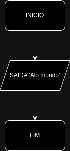
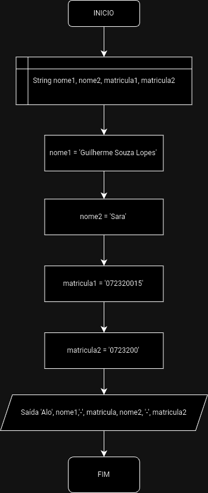
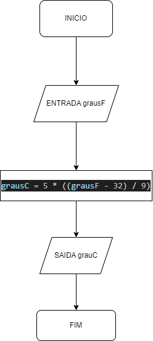
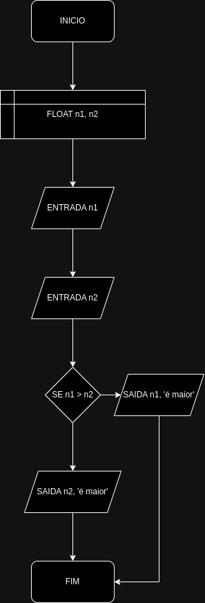
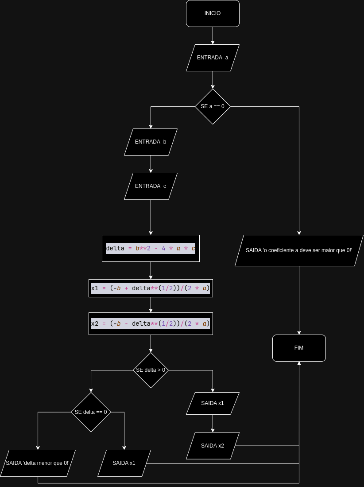

<h1>Exercicio 1</h1>
<h2>Codigo Python</h2>
(Codigo python)
<h2>Descrição Narrativa</h2>
(Descrição narrativa)
<h2>Pseudocodigo</h2>
(Pseudocodigo)
<h2>Fluxograma</h2>

<h1>Exercicio 2</h1>
<h2>Codigo Python</h2>
(Codigo python)
<h2>Descrição Narrativa</h2>
(Descrição narrativa)
<h2>Pseudocodigo</h2>
(Pseudocodigo)
<h2>Fluxograma</h2>

<h1>Exercicio 8</h1>
<h2>Codigo Python</h2>
<a href="https://github.com/guilhermelopes19/atividade-pratica-2/blob/main/exer8/exer8.py">(Codigo python)</a>
<h2>Descrição Narrativa</h2>
<a href="https://github.com/guilhermelopes19/atividade-pratica-2/blob/main/exer8/descricao-narrativa-exer8.txt">(Descrição narrativa)</a>
<h2>Pseudocodigo</h2>
<a href="https://github.com/guilhermelopes19/atividade-pratica-2/blob/main/exer8/pseucodigo-exer8.por">(Pseudocodigo)</a>
<h2>Fluxograma</h2>

<h1>Exercicio 12</h1>
<h2>Codigo Python</h2>
(Codigo python)</h2>
<h2>Descrição Narrativa</h2>
(Descrição narrativa)
<h2>Pseudocodigo</h2>
(Pseudocodigo)
<h2>Fluxograma</h2>

<h1>Exercicio 28</h1>
<h2>Codigo Python</h2>
<a href="https://github.com/guilhermelopes19/atividade-pratica-2/blob/main/exer28/exer28.py">(Codigo python)</a>
<h2>Descrição Narrativa</h2>
<a href="https://github.com/guilhermelopes19/atividade-pratica-2/blob/main/exer28/descricao-narrativa-exer28.txt">(Descrição narrativa)</a>
<h2>Pseudocodigo</h2>
<a href="https://github.com/guilhermelopes19/atividade-pratica-2/blob/main/exer28/pseudocodigo-exer28.por">(Pseudocodigo)</a>
<h2>Fluxograma</h2>

