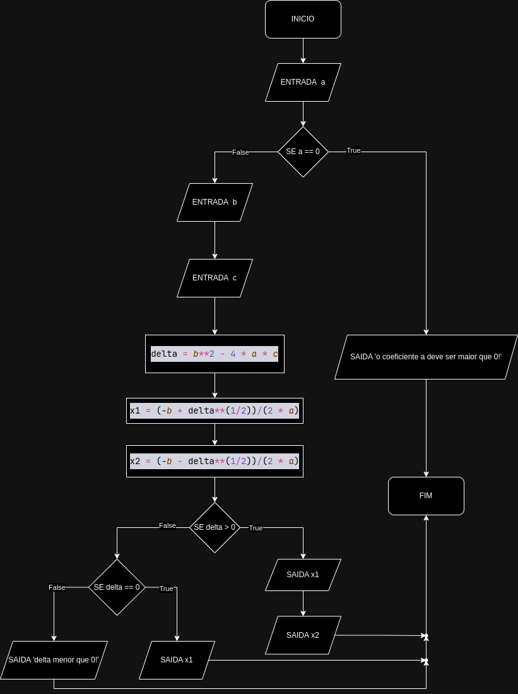

#Exercicio 1
(Codigo python)[]
##Descrição Narrativa
(Descrição narrativa)[]
##Pseudocodigo
(Pseudocodigo)[]
##Fluxograma

#Exercicio 2
(Codigo python)[]
##Descrição Narrativa
(Descrição narrativa)[]
##Pseudocodigo
(Pseudocodigo)[]
##Fluxograma

#Exercicio 8
##Codigo python
(Codigo python)[]
##Descrição Narrativa
(Descrição narrativa)[]
##Pseudocodigo
(Pseudocodigo)[]
##Fluxograma

#Exercicio 12
(Codigo python)[]
##Descrição Narrativa
(Descrição narrativa)[]
##Pseudocodigo
(Pseudocodigo)[]
##Fluxograma

#Exercicio 28
(Codigo python)[]
##Descrição Narrativa
(Descrição narrativa)[]
##Pseudocodigo
(Pseudocodigo)[]
##Fluxograma

